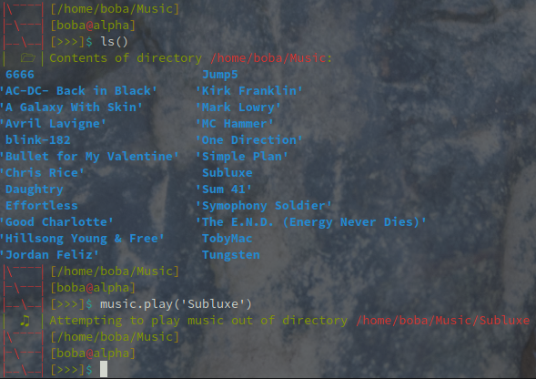

# DigitalSwissArmyKnife
[](https://forthebadge.com)

(Pre-release documentation, still incomplete)

A digital multitool that uses a customized Python interpreter as a base



**Note:** This README file is **incomplete** and DSAK is still under **heavy development** so nothing will be stable or accurate.

# Contents
* [About](#about)
  * [Information](#information)
  * [Features](#features)
      * [Interpreter](#interpreter)
      * [dsaklib](#dsaklib)
        * [cmdpkg](#cmdpkg) 
          * [Base Commands](#base-commands)
          * [Future Module Ideas](#future-module-ideas)
          * [Adding Custom Command Sets](#adding-custom-command-sets)
        * [shortcode](#shortcode) 
          * [Features](#features)
* [Installation](#installation)


# About
About section

## Information
Digital Swiss Army Knife (or DSAK for short), is a digital command line utility written in Python that runs on a customized interpreter through a modified version of the `code` module.

# Features

## dsaklib
**dsaklib** is the custom library that contains the modules used for DSAK

### cmdpkg
cmdpkg is a system of module-based command "packages" that you can import into the DSAK (or any other Python interpreter or script). By default, the `main.py` script will import `cmdpkg.base` by default like this:

```py
from dsaklib.cmdpkg.base import * #Imports base commands
```

There are also a few other utilities that come packaged by default, you can import them this way at the moment:

```py
from dsaklib.cmdpkg.misc import * #Imports a small set of misc commands
```

#### Base Commands
Here are a handful of base commands:

Command   | Description | Function it calls
--------- | ----------- | -------------
`cd()`    | Change directory | `os.chdir()`
`ls()`    | Shows the files of your current directory | `os.system('ls')`
`clr()`   | Clears the screen | `os.system('clear')`
`cls()`   | Same as `clr()` | `clr()`
`clear()` | Same as `clr()` | `clr()`
`edit()`| Opens the default editor unless another is specified. | `os.system('$EDITOR')`

(The function these call isn't exact to the source code, these also aren't final)

Here is some example shell usage:

```
⎹\⎺⎺⎺⎺⎸[/home/boba/coding-projects/DSAK/DigitalSwissArmyKnife]
⎹⎻\⎻⎻⎻⎸[boba@alpha]
⎹⎼⎼\⎼⎼⎸[>>>]$ ls() # Views contents of folder
dsakvenv  LICENSE  main.py  README.md  src  start
⎹\⎺⎺⎺⎺⎸[/home/boba/coding-projects/DSAK/DigitalSwissArmyKnife]
⎹⎻\⎻⎻⎻⎸[boba@alpha]
⎹⎼⎼\⎼⎼⎸[>>>]$ cd('..') # Change to parent directory
|🗁  Attempting to switch to directory ..
|🗁  Done
⎹\⎺⎺⎺⎺⎸[/home/boba/coding-projects/DSAK]
⎹⎻\⎻⎻⎻⎸[boba@alpha]
⎹⎼⎼\⎼⎼⎸[>>>]$ 
```

#### Future Module Ideas
* Something that handles compression using `tar`
* Encrypt files using [glew](https://github.com/B00bleaTea/glew)

#### Adding Custom Command Sets
**(incomplete)**

Here is an example template command set module:

```py
'''INFO
Name:        template
Description: A template command set
Author(s):   Robert Furr
Year:        2021

This and all other command sets are Licensed under the GNU General Public License. For more info, see the LICENSE file included with DSAK.
'''
def hello():
  # Add an description to every definition
  '''Prints hello world (example command)'''
  print('Hello, world!')

```

### shortcode
Utility module that is fine tuned to make the code for DSAK more simple.

### Features
(coming soon)

### Extra

If you encounter any bugs, please open an issue! :)

[](https://forthebadge.com)

# Installation

**1.** Clone or download this repo

**2.** Make a virtualenv using `python3 -m venv dsakvenv`

**3.** Execute the `main.py` file by doing `python3 main.py` or by making it executable and doing `./main.py`